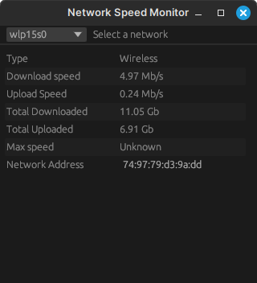

# Netspeed

Live GUI network speed monitor for Linux, written in Rust.



# Usage

Download and run the executable for linux from the Releases tab.

# Build from source

First, install [Rust toolchain](https://rustup.rs/) and dependencies

```sh
# Debian
sudo apt-get install -y libclang-dev libgtk-3-dev libxcb-render0-dev libxcb-shape0-dev libxcb-xfixes0-dev libxkbcommon-dev libssl-dev

# Fedora
dnf install clang clang-devel clang-tools-extra libxkbcommon-devel pkg-config openssl-devel libxcb-devel gtk3-devel atk fontconfig-devel
```

and then follow the usual Rust steps.

```
cd <path to project>
cargo run
```

# Licence

Copyright (C) 2023-Present Divyanshu Agrawal

This program is free software: you can redistribute it and/or modify
it under the terms of the GNU Affero General Public License as
published by the Free Software Foundation, either version 3 of the
License, or (at your option) any later version.

This program is distributed in the hope that it will be useful,
but WITHOUT ANY WARRANTY; without even the implied warranty of
MERCHANTABILITY or FITNESS FOR A PARTICULAR PURPOSE.  See the
GNU Affero General Public License for more details.

You should have received a copy of the GNU Affero General Public License
along with this program.  If not, see <https://www.gnu.org/licenses/>.